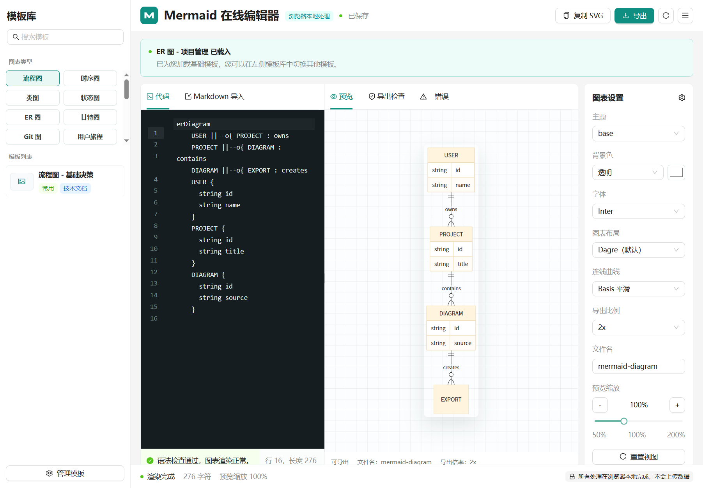
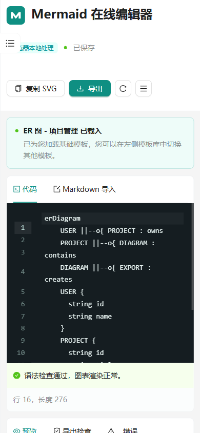

# Mermaid 在线编辑器

一个基于官方 Mermaid 渲染库的浏览器本地 Mermaid 在线编辑器。支持实时预览、模板库、语法辅助、主题与布局配置、Markdown 导入导出，以及 SVG / PNG / JPG 图片导出。

所有编辑、渲染、配置保存和导出均在浏览器本地完成，不依赖后端服务或云端存储。

## 界面预览

桌面端工作台：



窄屏/移动端布局：



## 功能

- 官方 Mermaid API 实时渲染，保留自由输入能力。
- CodeMirror 编辑器支持行号、缩进和长行换行。
- 模板库覆盖流程图、时序图、类图、状态图、ER 图、甘特图、Git 图、用户旅程、饼图、象限图、需求图、思维导图、时间线、Sankey、XY 图、块图、数据包图、看板、架构图、雷达图、树状图和韦恩图。
- 语法辅助会根据 Mermaid 解析错误展示友好提示、定位行号，并提供安全插入片段。
- 设置面板支持主题、预览背景、字体、Dagre/ELK 布局、连线曲线、导出倍率和文件名；设置会保存到浏览器 localStorage。
- 支持从粘贴文本或本地 `.md` 文件中提取多个 Mermaid fenced code block，并选择要载入的代码块。
- 支持导出 SVG、PNG、JPG 和 Markdown；PNG/JPG 导出会复用预览背景设置。
- 源码 Frontmatter 配置优先于面板设置，界面会提示被覆盖的字段。

## 本地运行

```bash
npm install
npm run dev
```

Vite 默认会在终端输出本地访问地址，通常是 `http://localhost:5173/`。

## 验证

```bash
npm test -- --run
npm run lint
npm run build
```

## 构建

```bash
npm run build
```

Vercel 会使用 `npm run build` 构建，并部署 `dist` 目录。

## 数据与导出说明

- 源码和设置保存在当前浏览器的 localStorage 中，不会上传到服务器。
- SVG 导出直接保存 Mermaid 渲染结果。
- PNG/JPG 导出使用 `canvg` 将 SVG 渲染到 Canvas，再生成图片文件。
- JPG 不支持透明背景；当预览背景为透明时，JPG 导出会使用白色背景。
