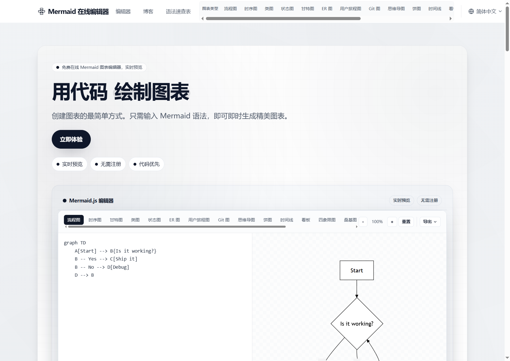
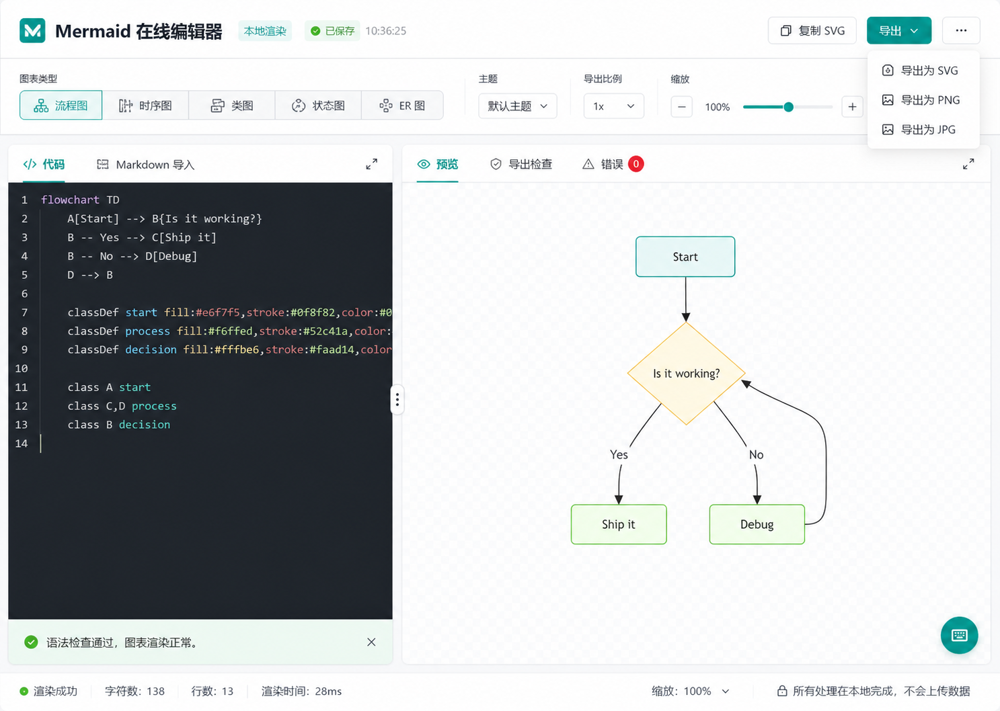
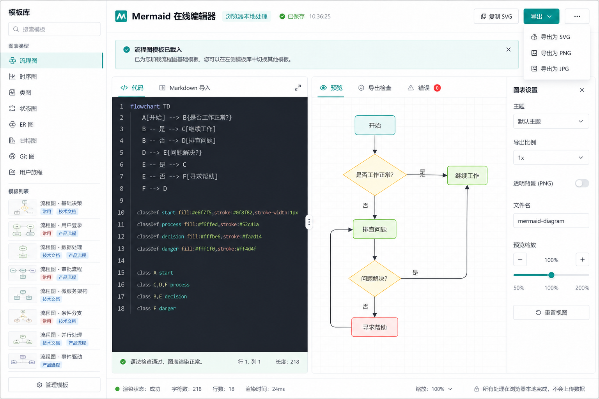
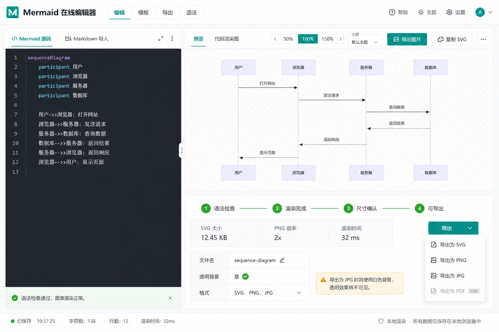

# Mermaid 在线编辑器 Ant Design 设计规格

## 1. 设计目标

基于 `docs/prd-mermaid-online-editor.md`，将产品定位为一个专业、免登录、首屏可用的 Mermaid 在线编辑工作台。界面采用 Ant Design v5 的组件体系和视觉语言，强调工具效率、状态清晰、导出可靠、本地隐私。

本设计不做营销落地页，首屏就是编辑器。

## 2. 参考与概念图

参考站点首屏截图：

生成的三个 Ant Design 方向：

### 方案 A：Focus Workbench

定位：最适合 MVP。顶部工具栏 + 双栏编辑预览 + 底部状态栏，路径短、实现稳、学习成本低。

### 方案 B：Template Launchpad

定位：适合 V1.1 模板增强。左侧模板库让新用户更容易开始，适合图表类型和示例数量增加后的版本。

### 方案 C：Export Studio

定位：适合导出增强。把导出前检查、尺寸、格式、背景和渲染时间显性化，适合对图片交付质量要求高的用户。

## 3. 推荐方案

推荐主方案：**B：Template Launchpad**。

理由：

1. 左侧模板库更符合新用户从模板起步的核心场景，能降低 Mermaid 语法门槛。
2. 中间代码和预览仍然保持高效率工作台布局，不牺牲开发者编辑体验。
3. 右侧图表设置把主题、倍率、透明背景、文件名和缩放集中管理，符合 Ant Design 表单化工具面板习惯。
4. 方案 B 同时覆盖 MVP 和 V1.1 模板增强，后续只需继续补充导出检查能力。

组合策略：

- MVP：采用方案 B 的左侧模板库、双栏工作区和右侧设置面板。
- V1.1：增强模板搜索、分类、标签和自定义模板管理。
- V1.2：引入方案 C 的导出检查面板。

## 4. 信息架构

### 4.1 顶部 Header

用途：品牌识别、保存状态、核心导出操作。

元素：

- Logo + 产品名：`Mermaid 在线编辑器`
- 标签：`本地渲染`
- 状态：`已保存`、`渲染中`、`语法错误`
- 主操作：
  - `复制 SVG`
  - `导出` Dropdown：SVG、PNG、JPG
  - 更多菜单：恢复示例、打开模板、查看语法、清空编辑器

Ant Design 组件：

- `Layout.Header`
- `Space`
- `Typography.Title`
- `Tag`
- `Badge`
- `Button`
- `Dropdown`
- `Tooltip`

### 4.2 图表与设置工具栏

用途：让用户快速切换图表类型、主题、倍率和缩放。

元素：

- 图表类型：流程图、时序图、类图、状态图、ER 图
- 主题：默认主题、base、neutral、forest、dark
- 导出倍率：1x、2x、3x、4x
- 缩放：减号、百分比、Slider、加号
- 重置视图

Ant Design 组件：

- `Segmented`
- `Select`
- `Slider`
- `Button`
- `Divider`

### 4.3 主工作区

用途：编辑 Mermaid 源码并实时预览。

布局：

- 左侧：代码编辑区，默认 44%-46% 宽。
- 右侧：预览区，默认 54%-56% 宽。
- 中间可拖拽调整。

Ant Design 组件：

- `Splitter`
- `Splitter.Panel`
- `Tabs`
- `Alert`
- `Spin`
- `Empty`

左侧 Tabs：

- `代码`
- `Markdown 导入`，后续版本启用

右侧 Tabs：

- `预览`
- `导出检查`
- `错误`

### 4.4 底部状态栏

用途：持续反馈渲染、字符数、行数、缩放和隐私状态。

元素：

- 渲染状态：成功、渲染中、错误
- 字符数
- 行数
- 渲染时间
- 缩放比例
- `所有处理在本地完成，不会上传数据`

Ant Design 组件：

- `Layout.Footer`
- `Badge`
- `Space`
- `Typography.Text`
- `Tag`

## 5. 核心状态设计

### 5.1 正常状态

预览区展示图表，导出按钮可用。

反馈：

- Header 状态显示 `已保存`
- 底部状态显示 `渲染成功`
- 编辑区底部显示成功 `Alert`

### 5.2 渲染中

用户输入后进入短暂渲染状态。

反馈：

- 预览区保留上一张可用图表，叠加轻量 `Spin`
- 状态显示 `渲染中`
- 导出按钮可临时禁用，避免导出旧图

### 5.3 语法错误

Mermaid 解析失败。

反馈：

- 预览区显示 `Alert type="error"` 或错误面板
- 右侧 Tabs 的 `错误` 带红色 Badge
- 导出和复制按钮禁用
- 编辑器不清空，保留用户输入

### 5.4 空状态

源码为空。

反馈：

- 预览区使用 `Empty`
- 提供按钮：`载入流程图模板`
- 导出按钮禁用

### 5.5 导出成功

用户导出 SVG、PNG、JPG 后。

反馈：

- 使用 `message.success`
- 文案：`已导出 PNG`
- 不弹 Modal，保持工作流不中断

### 5.6 导出失败

导出过程中失败。

反馈：

- 使用 `message.error`
- 文案：`导出失败，请重试或改用 SVG`
- 导出检查面板可展示更具体原因

## 6. Ant Design 组件映射

| 产品区域 | 推荐组件 |
| --- | --- |
| 页面骨架 | `Layout` |
| 顶部操作区 | `Header`、`Space`、`Button`、`Dropdown` |
| 模板入口 | `Segmented`、`Drawer` 或 `Sider + Menu` |
| 编辑/预览分栏 | `Splitter` |
| 编辑器页签 | `Tabs` |
| 图表类型切换 | `Segmented` |
| 主题和倍率 | `Select` |
| 缩放 | `Slider`、`Button` |
| 错误提示 | `Alert`、`Badge` |
| 空状态 | `Empty` |
| 导出反馈 | `message` |
| 高级设置 | `Drawer` |
| 引导 | `Tour` |
| 帮助入口 | `FloatButton` |

## 7. 视觉规范

### 7.1 色彩

建议使用 Ant Design 默认中性色体系，主色保留 Mermaid 工具感：

- `colorPrimary`: `#0f8f82`
- 成功：使用 Ant Design `colorSuccess`
- 错误：使用 Ant Design `colorError`
- 警告：使用 Ant Design `colorWarning`
- 页面背景：`colorBgLayout`
- 面板背景：`colorBgContainer`
- 分割线：`colorSplit` / `colorBorderSecondary`

避免大面积渐变、紫蓝主题、装饰性背景块。

### 7.2 字体

- UI 字体：Ant Design 默认系统字体栈。
- 代码字体：`fontFamilyCode`，例如 `SFMono-Regular, Consolas, Liberation Mono, Menlo, monospace`。
- 标题控制在 18-24px，不做营销型大标题。
- 工具栏文字以 12-14px 为主。

### 7.3 间距与圆角

- 使用 Ant Design 4px 基础间距体系。
- Header 高度建议 64px。
- 工具栏高度建议 64-72px。
- 内容面板间距 12-16px。
- 圆角不超过 8px，保持工具产品的专业感。

## 8. 响应式设计

### 桌面端，宽度 ≥ 1200px

- Header + 工具栏 + 左右 Splitter。
- 左侧编辑 44%-46%，右侧预览 54%-56%。
- 模板库默认使用 `Drawer` 或隐藏入口，不占主工作区。

### 平板端，宽度 768-1199px

- Header 操作折叠为更多菜单。
- 图表类型横向滚动或进入模板 Drawer。
- Splitter 可保持上下或左右，优先保持预览可读。

### 手机端，宽度 < 768px

- 使用 `Tabs` 在 `代码` 和 `预览` 间切换。
- 导出按钮固定在顶部或底部操作区。
- 缩放和主题进入 Drawer。
- 禁止控件重叠，按钮文字过长时只保留图标 + Tooltip。

## 9. 交互细节

1. 图表类型点击后，弹出确认或提示：当前代码会被模板替换。
2. 导出按钮只在 `ready` 状态可用。
3. `复制 SVG` 成功后用 message 反馈，不打断用户。
4. 错误状态下自动切到 `错误` Badge，但不强制切换用户当前 Tab。
5. Splitter 尺寸变化可保存到本地，下次打开恢复。
6. 缩放只影响预览，不影响导出倍率。
7. 导出倍率只影响 PNG/JPG，不影响 SVG。
8. `透明背景` 仅对 PNG 生效，JPG 旁展示白底提示。

## 10. 分阶段落地

### MVP 改造

- 引入 Ant Design。
- 使用 `Layout` 重建页面骨架。
- 使用 `Splitter` 替换当前 CSS grid 分栏。
- 使用 `Tabs`、`Segmented`、`Select`、`Button`、`Dropdown` 重建工具栏。
- 使用 `message` 替换自定义 toast。
- 保留现有 Mermaid 渲染和导出逻辑。

### V1.1 模板增强

- 新增模板数据结构。
- 使用 `Drawer` 或 `Sider` 展示模板库。
- 模板支持分类、标签和搜索。

### V1.2 导出增强

- 新增导出检查 Tab。
- 展示渲染时间、SVG 大小、导出倍率、背景设置。
- 支持透明 PNG 和自定义文件名。

## 11. 验收标准

1. 首屏直接进入编辑器，没有营销页。
2. 所有主要控件使用 Ant Design 组件或符合 Ant Design 尺寸、圆角、状态规则。
3. 编辑、预览、导出三个核心路径在桌面端一屏内完成。
4. 语法错误、空状态、渲染中和导出失败都有明确反馈。
5. 移动端代码和预览不重叠，关键操作可触达。
6. SVG、PNG、JPG 导出路径不被新 UI 破坏。
7. 用户能明确看到“本地渲染/不上传数据”的隐私信号。
